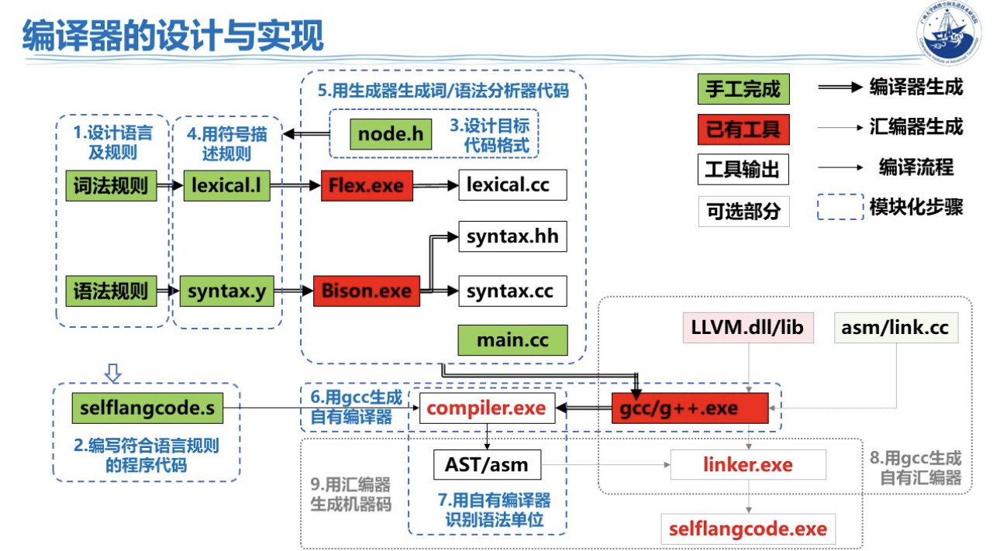
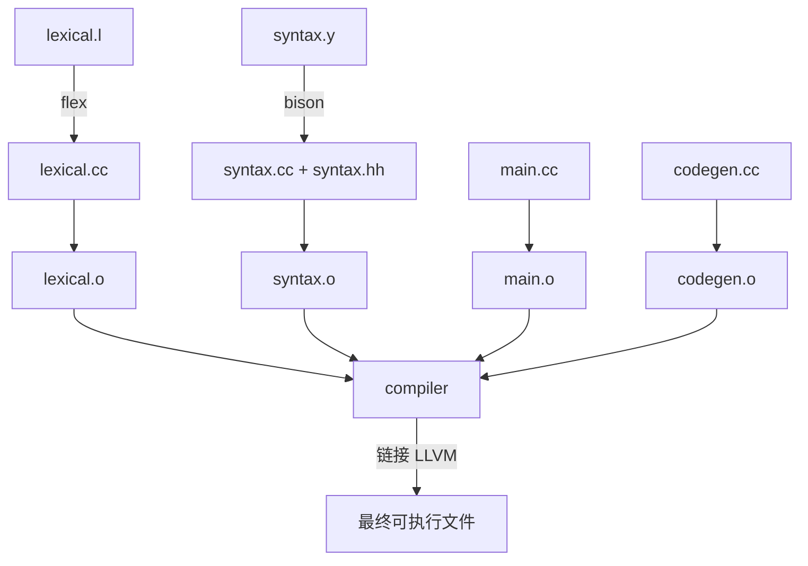

<h1 align="center">PiPiXia 编译器</h1>

<p align="center">
  
</p>

<h3 align="center">基于 LLVM 的现代编程语言编译器</h3>

<p align="center">
  
  
  
  
</p>

---

## 📖 项目概述
**PiPiXia** 语言编译器，是可以在 **Ubuntu**/**MacOS (Apple Silicon)** 上运行的，基于 **C++ ,Bison, Flex，Make，LLVM** 等工具实现的编译器。  

### 🎯 核心特性

- **🔧 词法分析**：基于 Flex 实现高效的词法扫描
- **📐 语法分析**：使用 Bison 进行语法解析和 AST 构建
- **📋 符号表**：生成结构化的符号表（变量、函数、参数）
- **📝 三地址码**：生成 SSA 风格的三地址码中间表示
- **⚡ 代码生成**：生成优化的 LLVM IR 中间代码

### 🛠️ 技术栈

| 组件 | 技术 | 用途 |
|------|------|------|
| **词法分析器** | Flex | Token 识别与扫描 |
| **语法分析器** | Bison | 语法解析与 AST 生成 |
| **中间代码** | LLVM IR | 平台无关的中间表示 |
| **编译器前端** | C++17 | 编译器核心逻辑 |
| **构建系统** | GNU Make | 自动化构建流程 |

### 📊 项目规模

| 类别 | 数量 | 说明 |
|------|------|------|
| **核心源代码** | ~7000 行 | 包含词法、语法、AST、代码生成、主程序 |
| **核心源文件** | 6 个 | lexical.l, syntax.y, node.h, codegen.cc/h, main.cc |
| **示例代码** | 69 个 | code/ 目录下的完整示例 |
| **测试用例** | 38 个 | test/ 目录下的功能测试 |
| **错误测试** | 40 个 | error/ 目录下的错误检测测试 |
| **自动化脚本** | 8 个 | 构建、测试、可视化等脚本 |
| **文档** | 6 个 | 语法教程、词法分析、语法分析、FAQ、故障排除、脚本指南 |

---

## 系统要求

### Ubuntu 24.04

- 已测试环境
    | 工具 | 版本 |
    |------|------|
    | g++ | 13.3.0 |
    | clang | 18.1.8 |
    | Bison | 3.8.2 |
    | Flex | 2.6.4 |
    | GNU Make | 4.3 |
    | LLVM | 21.0.0 |

- 依赖安装

  ```bash
  sudo apt update
  # 添加 LLVM 官方源以安装 LLVM 21
  wget -O - https://apt.llvm.org/llvm-snapshot.gpg.key | sudo apt-key add -
  sudo add-apt-repository "deb http://apt.llvm.org/jammy/ llvm-toolchain-jammy-21 main"
  sudo apt update
  sudo apt install bison flex llvm-21-dev liblld-21-dev clang-21 g++ make
  ```

---

### MacOS 15.5 (Apple Silicon)

- 已测试环境

    | 工具 | 版本 |
    |------|------|
    | g++ (Apple clang) | 17.0.0 |
    | clang | 21.1.5 |
    | Bison | 3.8.2 |
    | Flex | 2.6.4 |
    | GNU Make | 3.81 |
    | LLVM | 21.1.4 |

- 依赖安装

  ```bash
  xcode-select --install
  brew install bison flex llvm gcc make
  ```

- 环境配置

    安装完成后，将以下内容添加到 `~/.zshrc` 或 `~/.bash_profile`：

  ```bash
  # 使用 Homebrew 的 LLVM 工具链
  export PATH="/opt/homebrew/opt/llvm/bin:$PATH"
  export LDFLAGS="-L/opt/homebrew/opt/llvm/lib"
  export CPPFLAGS="-I/opt/homebrew/opt/llvm/include"
  export CMAKE_PREFIX_PATH="/opt/homebrew/opt/llvm"

  # 如果需要 libc++ 与 libunwind
  export LDFLAGS="$LDFLAGS -L/opt/homebrew/opt/llvm/lib/c++ -L/opt/homebrew/opt/llvm/lib/unwind -lunwind"

  # 支持 flex / bison
  export PATH="/opt/homebrew/opt/flex/bin:/opt/homebrew/opt/bison/bin:$PATH"
  ```

  配置后重新加载配置文件：
  ```bash
  source ~/.zshrc                # 或 source ~/.bash_profile
  ```

---

### 项目结构

  - **源文件**
    ```bash
    .
    ├── codegen.cc                # LLVM IR 代码生成器实现
    ├── codegen.h                 # 代码生成器头文件，定义 CodeGenerator 类
    ├── error.cc                  # 错误处理模块实现
    ├── error.h                   # 错误处理头文件，定义错误报告函数
    ├── lexical.l                 # Flex 词法分析器定义文件
    ├── main.cc                   # 编译器主程序入口
    ├── node.h                    # AST 语法树节点定义（表达式、语句、函数等）
    ├── syntax.y                  # Bison 语法分析器定义文件
    └── Makefile                  # 项目构建文件
    ```

  - **生成文件**（由构建过程自动生成，已在 .gitignore 中忽略）
    ```bash
    .
    ├── compiler                  # 最终生成的可执行编译器程序
    ├── lexical.cc                # Flex 生成的词法分析器 C++ 代码
    ├── syntax.cc                 # Bison 生成的语法分析器 C++ 代码
    ├── syntax.hh                 # Bison 生成的语法分析器头文件
    ├── codegen.o                 # 代码生成器目标文件
    ├── error.o                   # 错误处理模块目标文件
    ├── lexical.o                 # 词法分析器目标文件
    ├── main.o                    # 主程序目标文件
    └── syntax.o                  # 语法分析器目标文件
    ```

  - **目录结构**
    ```bash
    .
    ├── code/                       # 示例代码目录
    │   ├── *.ppx                   # PPX 源代码文件
    │   ├── *(可执行文件)             # 编译产物
    │   ├── *.ast                   # AST 中间文件
    │   ├── *.tokens                # Token 文件
    │   ├── *.ll                    # LLVM IR 文件
    │   └── README.md               # 示例代码说明
    │
    ├── document/                   # 项目文档目录
    │   ├── PPX语法教程.md           # PPX 语言语法完整教程
    │   ├── 词法分析.md              # 词法分析器设计文档
    │   └── 语法分析.md              # 语法分析器设计文档
    │
    ├── test/                       # 功能测试文件目录
    │
    ├── error/                      # 错误检测测试文件目录
    │
    ├── scripts/                    # 自动化脚本目录
    │   ├── 01_detect_platform.sh   # 平台检测脚本
    │   ├── 02_auto_build.sh        # 自动构建脚本
    │   ├── 03_make_test.sh         # 测试脚本
    │   ├── 04_make_clean.sh        # 清理脚本
    │   ├── 05_run_tests.sh         # 运行所有测试
    │   ├── 06_visualize_ast.sh     # AST 批量可视化脚本
    │   ├── 07_build_code.sh        # 批量编译 code/ 目录脚本
    │   └── ast_visualizer.py       # AST 转图片工具（Python）
    │
    ├── output/                     # 编译输出目录
    │   ├── ast_visualized/         # AST 可视化图片
    │   ├── ast/                    # AST 输出目录
    │   ├── exec/                   # 可执行文件输出
    │   ├── llvm/                   # LLVM IR 输出
    │   ├── symbols/                # 符号表输出
    │   ├── tac/                    # 三地址码输出
    │   └── token/                  # Token 输出
    │
    ├── static/                     # 静态资源目录
    │   ├── avatar.png              # 项目 Logo
    │   └── photo.png               # 编译流程图
    │
    └── report/                     # 脚本运行报告目录
    ```

  - **配置和脚本文件**
    ```bash 
    .
    ├── README.md                   # 项目说明文档
    ├── LICENSE                     # MIT 开源协议
    ├── ToDo.md                     # 待办事项清单
    ├── .gitignore                  # Git 忽略配置文件
    ├── .platform_config            # 平台检测结果
    └── run.sh                      # 快速运行脚本
    ``` 

---

### 编译与运行

- 编译

    ```bash
    cd PiPiXia-toy
    make
    ```

    ```bash
    # 如果看到如下输出后表示编译成功  
    Build complete! Compiler: compiler
    皮皮虾编译器构建成功！
    ```

- **编译选项**
    ```
    ./compiler -h 

    用法: ./compiler <输入文件.ppx> [选项]
    选项:
      -o <输出>      指定输出文件名
      -tokens        输出词法分析结果（.tokens），不生成可执行文件
                     可使用 -tokens -o <目录/文件.tokens> 指定输出路径
      -ast           输出抽象语法树（.ast），不生成可执行文件
                     可使用 -ast -o <目录/文件.ast> 指定输出路径
      -symbols       输出符号表（.symbols），不生成可执行文件
                     可使用 -symbols -o <目录/文件.symbols> 指定输出路径
      -tac           输出三地址码（.tac），不生成可执行文件
                     可使用 -tac -o <目录/文件.tac> 指定输出路径
      -llvm          输出 LLVM IR 文件（.ll），不生成可执行文件
                     可使用 -llvm -o <目录/文件.ll> 指定输出路径
      -c             输出目标文件（.o），不生成可执行文件
                     可使用 -c -o <目录/文件.o> 指定输出路径
      -v, --verbose  启用详细日志 (AST 解析和 IR 生成)
      -Wall          启用所有警告
      -Werror        将警告视为错误
      -w             禁用所有警告
      -Wno-unused    禁用未使用变量警告
      -Wshadow       启用变量遮蔽警告
      -h, --help     显示帮助信息
    ```

- **词法分析**
    ```bash
    ./compiler code/01_hello_world.ppx -tokens
    # 生成: code/01_hello_world.tokens
    
    # 自定义输出位置和文件名
    ./compiler code/01_hello_world.ppx -tokens -o output/custom.tokens
    ```

- **语法分析**
    ```bash
    ./compiler code/01_hello_world.ppx -ast
    # 生成: code/01_hello_world.ast
    
    # 自定义输出位置和文件名
    ./compiler code/01_hello_world.ppx -ast -o output/custom.ast
    ```

- **符号表生成**
    ```bash
    ./compiler code/01_hello_world.ppx -symbols
    # 生成: code/01_hello_world.symbols
    
    # 自定义输出位置和文件名
    ./compiler code/01_hello_world.ppx -symbols -o output/custom.symbols
    ```

- **三地址码生成**
    ```bash
    ./compiler code/01_hello_world.ppx -tac
    # 生成: code/01_hello_world.tac
    
    # 自定义输出位置和文件名
    ./compiler code/01_hello_world.ppx -tac -o output/custom.tac
    ```

- **LLVM IR 生成**
    ```bash
    ./compiler code/01_hello_world.ppx -llvm
    # 生成: code/01_hello_world.ll
    
    # 自定义输出位置和文件名
    ./compiler code/01_hello_world.ppx -llvm -o output/custom.ll

    ```

- **编译为可执行文件**（默认）
    ```bash
    ./compiler code/01_hello_world.ppx
    # 生成: code/01_hello_world (可执行文件)
    
    # 自定义可执行文件名
    ./compiler code/01_hello_world.ppx -o myapp
    ```

- **编译为中间文件**
    ```bash
    ./compiler code/01_hello_world.ppx -c
    # 生成: 01_hello_world.o

    # 自定义输出位置和文件名
    ./compiler code/01_hello_world.ppx -c -o output/custom.o
    ```

- **详细模式**（查看完整编译过程）
    ```bash
    ./compiler code/01_hello_world.ppx -v
    # 或 ./compiler code/01_hello_world.ppx --verbose
    ```

- **运行可执行文件**
    ```bash
    ./code/01_hello_world
    # 输出: Hello World!
    ```

---

### PPX语言编译过程分析

### 技术栈

- **词法分析**: Flex (lexical.l)
- **语法分析**: Bison (syntax.y)
- **AST定义**: C++ (node.h)
- **代码生成**: LLVM C++ API (codegen.cc/h)
- **主程序**: C++ (main.cc)
- **构建系统**: Makefile

#### 编译流程

- 编译流程图参照（基于此图进行设计但不完全相同）
    

- 词法分析阶段

    文件: lexical.l
    工具: Flex
    过程:
    - Flex读取.l文件，生成lexical.cc
    - 将源代码字符流转换为token流

- 语法分析阶段

    文件: syntax.y
    工具: Bison
    过程:
    - Bison读取.y文件，生成syntax.cc和syntax.hh
    - 根据语法规则构建抽象语法树(AST)

- AST构建阶段 

    文件: node.h
    节点类型: 定义了完整的AST节点体系

- LLVM IR代码生成阶段

    文件: codegen.cc, codegen.h
    过程: 遍历AST，生成LLVM中间表示

    代码生成步骤:
    - 初始化LLVM环境
    - 声明内置函数（print, input, len, pow, to_int, to_double, to_string, free）
    - 遍历AST节点，生成对应的LLVM IR指令
    - 类型转换和类型检查
    - 内存管理（临时字符串的malloc/free）
    - 模块导入处理（import语句）

- 目标代码生成阶段

    过程: LLVM IR → 机器码 → 可执行文件

---

## 编译器构建流程图

### 构建步骤总览



### 详细构建过程

#### 步骤1: 生成词法分析器
```bash
flex -o lexical.cc lexical.l
```
**输入**: `lexical.l` (Flex 词法规则)  
**输出**: `lexical.cc` (C++ 词法分析器源码)  
**功能**: 
- 识别关键字 (let, const, func, if, while, for, return 等)
- 识别类型 (int, double, string, bool, char)
- 识别运算符 (+, -, *, /, //, %, ==, !=, <, >, <=, >=, &&, ||, !)
- 识别字面量 (整数、浮点数、字符串、字符、布尔值)
- 识别标识符
- 处理注释 (单行 # 和多行 /#/ ... /#/)

#### 步骤2: 生成语法分析器
```bash
bison -d -o syntax.cc syntax.y
```
**输入**: `syntax.y` (Bison 语法规则)  
**输出**: 
- `syntax.cc` (C++ 语法分析器源码)
- `syntax.hh` (语法分析器头文件，包含 token 定义)

**功能**:
- 构建抽象语法树 (AST)
- 支持语法结构:
  - 变量声明 (let/const)
  - 函数声明 (func)
  - 控制流 (if/else, while, for)
  - 表达式 (算术、逻辑、比较)
  - 函数调用、数组访问
  - import 语句
  - try/catch/throw 异常处理

#### 步骤3: 编译词法分析器
```bash
g++ -std=c++17 -Wall -Wno-deprecated-register [LLVM_FLAGS] \
    -Wno-unused-function -c lexical.cc -o lexical.o
```

#### 步骤4: 编译语法分析器
```bash
g++ -std=c++17 -Wall [LLVM_FLAGS] -c syntax.cc -o syntax.o
```

#### 步骤5: 编译主程序
```bash
g++ -std=c++17 -Wall [LLVM_FLAGS] -c main.cc -o main.o
```

#### 步骤6: 编译代码生成器
```bash
g++ -std=c++17 -Wall [LLVM_FLAGS] -c codegen.cc -o codegen.o
```

#### 步骤7: 链接生成编译器
```bash
g++ -std=c++17 -Wall [LLVM_FLAGS] -o compiler \
    lexical.o syntax.o main.o codegen.o [LLVM_LDFLAGS]
```
**输出**: `compiler` (PiPiXia 编译器可执行文件)


### 快速构建

```bash
# 构建编译器
make

# 或者完整构建
make all

# 查看构建信息
make info
```

---

## 快速开始

### 1. 克隆项目并编译

```bash
git clone <repository-url>
cd toy
make
```

### 2. 运行 Hello World 示例

```bash
# 编译并运行
./compiler code/01_hello_world.ppx -o output/exec/hello
./output/exec/hello
```

### 3. 查看编译过程

```bash
# 查看 Token 流
./compiler code/01_hello_world.ppx -tokens

# 查看 AST
./compiler code/01_hello_world.ppx -ast

# 查看符号表
./compiler code/01_hello_world.ppx -symbols

# 查看三地址码
./compiler code/01_hello_world.ppx -tac

# 查看 LLVM IR
./compiler code/01_hello_world.ppx -llvm
```

### 4. 运行测试套件

```bash
# 运行所有测试
./scripts/05_run_tests.sh

# 或使用交互式菜单
./run.sh
```

---

### 运行测试

#### 方式一：使用测试脚本

```bash
# 运行 test/ 目录下的所有测试
./scripts/05_run_tests.sh
```

**输出示例**：
```
========================================
  PiPiXia 编译器测试套件
========================================

找到 5 个测试文件

[1/5] 测试文件: 01_hello_world.ppx
  ✓ 编译成功
  ✓ 运行成功
  
总测试数: 5
成功: 5
失败: 0

🎉 所有测试通过！

详细报告已保存到: /path/to/report/test_report_*.md
```

#### 方式二：使用交互式菜单

```bash
./run.sh
```

选择相应的脚本选项运行。

#### 方式三：手动运行单个示例

```bash
# 编译
./compiler code/02_addition.ppx -o output/exec/addition

# 运行
./output/exec/addition
```

### 测试报告

测试脚本会自动生成详细的测试报告，保存在 `report/` 目录：

**报告内容包括**：
- 每个测试文件的编译结果
- 运行结果和完整输出
- 测试统计（通过/失败数量）
- 可执行文件大小
- 生成的中间文件位置（AST、LLVM IR、Token 流等）

### 输出文件

编译过程会在 `output/` 目录生成多种中间文件：

```
output/
├── ast/              # 抽象语法树文件 (.ast)
├── ast_visualized/   # 可视化抽象树
├── exec/             # 可执行文件
├── llvm/             # LLVM IR 文件 (.ll)
├── symbols/          # 符号表文件 (.symbols)
├── tac/              # 三地址码文件 (.tac)
└── token/            # Token 流文件 (.tokens)
```

**示例**：编译 `test/01_hello_world.ppx` 会生成：
- `output/ast/test_01_hello_world.ast`
- `output/exec/test_01_hello_world`
- `output/llvm/test_01_hello_world.ll`
- `output/symbols/test_01_hello_world.symbols`
- `output/tac/test_01_hello_world.tac`
- `output/token/test_01_hello_world.tokens`

---

## 📚 文档索引

为了更好的阅读体验，详细文档已整理到 `document/` 目录：

### 核心文档

| 文档 | 内容 | 链接 |
|------|------|------|
| 📖 **PPX 语法教程** | 完整的语法参考和教程 | [查看](document/PPX语法教程.md) |
| 🔧 **词法分析** | 词法分析器设计和实现 | [查看](document/词法分析.md) |
| 📐 **语法分析** | 语法分析器设计和实现 | [查看](document/语法分析.md) |

### 使用指南

| 文档 | 内容 | 链接 |
|------|------|------|
| 🛠️ **脚本工具使用指南** | 自动化脚本详细说明 | [查看](document/脚本工具使用指南.md) |
| ❓ **常见问题 (FAQ)** | 快速问题解答 | [查看](document/FAQ.md) |
| 🔍 **故障排除** | 问题诊断和解决方案 | [查看](document/故障排除.md) |

### 快速参考

**基本语法示例**：
```ppx
# 变量声明
let x: int = 10
let name: string = "Alice"

# 函数定义
func add(a: int, b: int): int {
    return a + b
}

# 主函数
func main(): int {
    print("Hello, PiPiXia!")
    return 0
}
```

**常用脚本**：
```bash
./run.sh                          # 交互式菜单
./scripts/05_run_tests.sh         # 运行测试
./scripts/06_visualize_ast.sh     # AST 可视化
```

**快速调试**：
```bash
./compiler program.ppx -v         # 详细模式
./compiler program.ppx -tokens    # 查看 Token
./compiler program.ppx -ast       # 查看 AST
./compiler program.ppx -symbols   # 查看符号表
./compiler program.ppx -tac       # 查看三地址码
./compiler program.ppx -llvm      # 查看 LLVM IR
```

---

## ⚠️ 许可证声明

**本项目采用严格的专有许可证**。详细信息请参阅 [LICENSE](LICENSE) 文件。

### 重要条款：
- ✅ **允许**: 教育、研究、非商业用途
- ❌ **禁止**: 商业使用、重新分发、移除版权声明
- 📝 **必须**: 使用时注明原作者 [Dhgaj](https://github.com/Dhgaj)

### 版权信息
```
Copyright (c) 2025 Dhgaj (https://github.com/Dhgaj)
All rights reserved.
```

---

## 🤝 贡献

感谢你对 PiPiXia 项目的关注！在贡献之前，请仔细阅读：

- 📋 [贡献指南](.github/CONTRIBUTING.md)
- ⚖️ [许可证](LICENSE)
- 🔒 [安全政策](.github/SECURITY.md)

### 快速贡献流程

1. **阅读许可证**: 确保理解并同意项目条款
2. **Fork 项目**: 创建你的项目副本
3. **创建分支**: `git checkout -b feature/your-feature`
4. **开发测试**: 确保代码质量和测试覆盖
5. **提交 PR**: 使用提供的模板

### 报告问题

- 🐛 [Bug 报告](.github/ISSUE_TEMPLATE/bug_report.md)
- 🚀 [功能请求](.github/ISSUE_TEMPLATE/feature_request.md)
- ❓ [使用问题](.github/ISSUE_TEMPLATE/question.md)

---

## 🏆 致谢

感谢所有为 PiPiXia 项目做出贡献的开发者！

特别感谢以下技术栈：
- **LLVM**: 强大的编译器基础设施
- **Flex & Bison**: 词法和语法分析工具
- **C++17**: 现代 C++ 标准

---

## 📞 联系方式

- **项目维护者**: [Dhgaj](https://github.com/Dhgaj)
- **邮箱**: [sifanlian@gmail.com](mailto:sifanlian@gmail.com)
- **GitHub Issues**: 用于 bug 报告和功能请求
- **GitHub Discussions**: 用于一般讨论和交流

---

**PiPiXia, Launch!** 🚀

*本项目由 [Dhgaj](https://github.com/Dhgaj) 开发和维护*

*最后更新: 2025-12-19*
